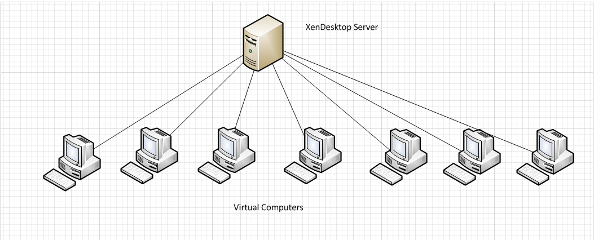

Welcome to the introductory course for computer resources here at SCRI.  This course will cover a basic introduction to the SCRI Citrix environment and also will introduce you to basic tools in linux.  If you have a bad case of CLAS (command line aversion syndrome), then this course should help you get on the road to recovery.


# Introduction to Citrix:

### What is Citrix?

Citrix is a platform for having access to programs on many different machines. This allows a user to log in to any machine on the network and continue working on their projects without having to have the program installed on every machine. This is very useful for nurses and students who move between locations a lot. But why is this imporant?

### Why Citrix?

For most here at Research you likely avoid citrix like the plague and/or don't intentionally use it because of the old thought that citrix is bad. However when needed citrix provides a steady platform of available programs to help complete most work. This includes access to email, Microsoft Office, and share drives from home. Infact you can get access to log into your local machine via the citrix applications to utilize those programs specific to your computer!

### Using Citrix safely?

Most wouldn't guess that Citrix is actually being used by just shy of everyone. Almost all of the icons on your desktop, besides a select few, are populated when citrix loads. How you access citrix and how you save what you are working on makes the difference when it comes to citrix. Knowing how to use your citix can be the difference to having an important document and having to rebuild from scratch. So we will go over some of the safest ways you can use citrix to your advantage!


#### Citrix was determined to be a useful part of this Initiative in order to more accurately familiarize you with the tools at your disposal and how to safely use them.

To start off please ensure you have completed the following:

1.	You have logged on the PDN : Directionhistoric
2.	Navigated to https://desktops.seattlechildrens.org 
3.	Logged in with Gemalto using your pin or dongle
4.	Copied the Mobaxterm mobile app to your "O:\ Drive"

Terms you might hear in this lesson are: VDI, VDS, Virtual Machine, Virtual Computer, XenDesktop, and XenApp. These are important to mention so you understand the differences.

* VDI = Virtual Device Infrastructure really meaning a hardware device that runs a virtual machine.
* VDS= Virtual Desktop Session is a session accessing software on a server.
* ACL = Access Control List Enables/Denies Communication between Computers and Servers.
* Xenapp = Server that is pushing apps to your account.
* XenDesktop = Session loaded on VDI's and when you log into https://desktops.seattlehchildrens.org/
* Virtual Machine = Virtual Computer they are equal in meaning. It is a virtual computer running on a server off in a different location.

### Diagram 1


### Diagram 2:


### Diagram 3:


Using the "O:\ Drive" or your group share as a single point of access is the safest way to save and access data because it is not only accessible everywhere you go but it is also backed up. This cannot be stressed enough!


#### __Exercise C1:__ 
1.	Open "My Citrix Computer" From the desktop and pin it to the right of the screen. We will refer to this as "Citrix"
2.	Create a file called textfile1.txt on your "O:\ Drive"
3.	Open the "Computer" by Clicking Start > Computer and pin that Window to the left of your screen.
4.	Navigate to the text document on your "O:\ Drive" in the left Window which we will call your local machine.
5.	Try and drag it from your local machine to your Citrix.
a.	(Notice how there is a Denial symbol?) This is because you cannot transfer between your Local machine and Citrix. See Diagram 3
b.	Leave both Windows open for Exercise 2.


#### __Exercise C2:__ 
1.	Lower down the "local machine" window.
2.	Open "Microsoft Outlook 2010" from your desktop. Pin it to the left side of your screen.
3.	Locate the "Dummy Email" sent to you this morning. If you did not receive it let me know.
4.	Drag the "Dummy Email" from Outlook to your "O:\ Drive" on "Citrix"
a.	(Notice how it allowed you to transfer the email there?)
5.	Open a new email and drag the text document from your "O:\ Drive" on "Citrix" to the new email.
a.	(Notice how it attached properly?)
Citrix can talk to Citrix and local can talk to local. If you have ever struggled to attach that word document or important grant to your email and had trouble it is likely that you were trying to use a mixed environment scenario.


#### __Exercise C3:__ 
1.	Open both local and Citrix windows the same way as in Exercise 1. Local on the left, Citrix on the right.
2.	Navigate to the "Desktop" on both. 
a.	(Notice that the amount of icons is different on both?)
3.	Navigate to the "O:\ Drive" on your Citrix Desktop and Copy the "New Text File1.txt" that you saved earlier.
4.	Now Navigate back to the "Desktop" in the Citrix window as before and paste the "NewTextFile1.txt" 
5.	Close out of the Citrix window.
6.	Open "My Citrix Computer" Once again and navigate to the "Desktop"
a.	(Notice how there is no text document on the desktop?)

Saving to the Citrix Desktop (the one with fewer icons), and closing out will cause you to lose what was saved there. This is because the Citrix window desktop is not actually an existing folder. Saving to the "O:\ Drive" or a department share is the single safest way to protect your data.


# Introduction to Linux: 

### What is Linux?  

Linux is a free open sourced operating system based on Unix.  It's technically not unix, but in practice it might as well be.  Unix is like a shark of the computer world in the sense that the basic design has been around forever and is still good for what it does.  It has not changed much because people are still finding it very useful and powerful to this day.

### Why do people use it?

People like unix because it is powerful and flexible tool for efficiently getting certain kinds of work done.  This is especially true for work that has never been done before or that requires the creation of customized work flows.  If this sounds familiar that's because this is the same kind of work that people often need to do to manage data in science.  And this is why so many scientists have found linux to be a useful platform for developing new work flows.  Everyone agrees that graphical interfaces can be nice.  But the odds that you will find one that already does exactly what your experiment needs get vanishingly small starting with the moment you do anything interesting.

### How is it organized?  

There are many flavors of unix, but most of them have the same basic directory structure.  You don't need to know about a lot of it in order to use it.  But you should know a couple of things.  The 1st is that the root directory is the base for the whole system.  Unless you are the system admin or are installing software or something, you probably don't belong down there.  More commonly you want to be in your home directory.  Your home is at ~/  We will talk more about this is a minute.


# An Introduction to the command line: 

> "An elegant weapon, for a more civilized age."

The command line is the main way that professional people interact with Unix.  You might be tempted to think that something so old cannot possibly be as good as a more modern graphical interface.  But the command line demonstrates how a simpler tool can often be superior to much more complicated solutions.  


### Lets start by logging you in:

To connect to a linux machine, one of the most common tools is `ssh` or 'secure shell'. You can use `ssh` to connect to a linux machine if you have permission to do do like this:

```
ssh user@hostname
```

Normally ssh is not the first command you would teach a new student of the linux command line, but in this case we want you to use this information to log into the sideswiper machine so that we can get started.


### What is tab-completion?

Before you type anything, please locate the tab key in the upper left part of your keyboard. You are going to be hitting that key a lot. That is because in Linux if you start to type something, even it you only know the first letter, you can hit the tab key for suggestions about what should come next. One hit on the tab key will complete if you have typed enough characters to narrow things down to only one solution, but two quick tabs will actually list out all remaining possibilities for you (and prompt you first if it's a large amount). Go ahead and try it! Type `pw` and then hit the tab key for suggestions about what we might do next...

### Up and down arrows, 'CTRL-a' and 'CTRL-e'

In unix, you can always get back to previous commands by hitting the up arrow.  If you step back too far, you can page the other way by hitting the down arrow.  Find yourself at the end of a very long command and want to get back to the beginning?  Hit 'CTRL-a'.  Want to get back to the end: 'CTRL-e'.

### Case sensitivity.

In Linux, the case of a letter matters. 'A' is not the same thing as 'a' etc.  So watch out for changes in case.  You will notice that some people prefer to name things using alternating lowercase and uppercase letters like this: 

```
myFile.txt
``` 
That style is called camel case.  

Other people prefer to use underscores like this:

```
my_file.txt
```

And still other people prefer all lowercase like this:

```
myfile.txt
```

Whatever style you prefer, these all have one thing in common: no spaces.  You shouldn't use white space in filenames when using linux.  You technically can do it, but everyone agrees that it's not worth it since you have to escape all your white space characters...  And this is a huge inconvenience.  So if you give someone a file like this in linux you should expect that they will probably be annoyed with you.


### Reserved Characters (also called "Special")

Like spaces, reserved characters should be avoided in file names.  Linux has two which are prohibited.  The null character, /0 and / which is the path separator.  Other reserved characters are allowed but special meaning to the system like the "-" which proceeds flags on the command line or "*" which is a wild card.  Like a space, you have to escape them which adds complexity and can lead to errors if you forget. 


### Using __`pwd`__, __`/`__ and __`~/`__

If you are used to interfacing with your computer via a graphical user interface such as Finder (Mac) or Windows Explorer (PC), the concept of a __root directory__ may be somewhat vague. The root directory is simply the most inclusive folder on the system, or in other words, the folder that contains all other folders and files. When working with the command line, no matter what system you use, you can designate an absolute path by describing its location relative to root. For Window's users, each disk drive has it's own root, for example `C:`, `D:`, etc. Unix based systems, including Mac OS X and Linux, have a single root designated simply by `/`.

__root__ is not to be confused with __home__. A home directory is merely a default location to store personal account settings and user-specific files. Note however, that home is not root. In linux, your home directory is always located at `/home/username`. Because this is a common stop for so many functions, a convenient short hand is used to designate home: `~/`

When working with the command line, you will notice that your view of the filesystem is always based relative to the directory that you are currently in. So it is very important to be able to figure out where you are relative to root, how to look around and see what files and directories are nearby, and how to move yourself to different locations.

This is how you know where you are:
 
```
pwd
```
 
`pwd` means print working directory.  It will tell you where in the file system you are by giving you the full path starting with root.

As you explore around, you will notice that there are many directories contained in `root`, and you may wonder what these are for and if they are important to you. The short answer is that unless you know exactly what a directory is for, __anything outside of your home directory should probably be left alone.__ We will talk more about these directories and how you should (or should not) use them in Course 4. 


### Directories, executables and files

Directories are for storing stuff, executables do things to stuff and files are stuff.  In Linux a full directory path will start with root and end with another `/` and use more `/`'s in between as separators for each subdirectory.  On most command lines directories will be colored to indicate that they are different from the files.  And in linux most executables are stored somewhere else, so you won't normally see those unless you are invoking them as commands.


### Using __`cd`__, __`.`__ and __`..`__

`cd` means change directory.  You call that command followed by a single argument to indicate which directory you want to change to.  

`.` means here.  You use it to indicate that the path to something is where you are right now.  

And `..` means one directory up from here.

So (for example), you could change to the root directory like this:
```
cd /
```

And then you could change back to your home directory like this:
```
cd ~/
```


### Using __`ls`__

`ls` is used to list a directory.  Which directory does it list?  That would be the second argument.  For example, the following command would list the contents of the root directory

```
ls /
```

And this would list the current directory.
```
ls .
```

But in practice when people want to list the current directory, they leave out the implicit `.` like so:
```
ls
```

And when I use this command, it tends to look like this:
```
ls -alh
```
Which translates to: list the directory, but list all the files (even hidden ones), and use the long format, and make the sizes human readable.  How did I ever learn to do that?


### Using __`man`__

Well I used the man command to learn more about `ls`.  You can use the man command to pull up a manual about any linux command like this:

```
man ls
```

When you are done looking at it, hit the `q` key to exit.


### flags

And while we are looking at an example of some, lets talk about `flags`.  In Linux, there are special arguments called flags.  They come after the command and always follow a dash (like `-alh` above).  What they do is modify the meaning of a function.  The man page for a command should always tell you about the different flags that a command supports.


### What are permissions?

Another thing you might have noticed about my longer form use of `ls` is that it puts a string of characters in from of each file and directory.  Lets look at a toy example:

```
-rw-r--r-- 1 username rleQAS_SCRI-Sudo 8.2K Oct  7 17:21 file.txt
```

Permissions are used by Linux to control who can do things. They can be applied to (u)sers, (g)roups, (o)thers, or (a)ll.  (u)sers means the user who owns (created) the file while (g)roups mean the group that the file belongs to, and (o)thers means people who are not in these first two categories.  In Linux everything belongs to someone, so ownership and permission to act accordingly is a big deal.  Also true in Linux, is that groups of users are tracked and assigned to each file.  But each of these categories (user, group or other) can have separate permissions set to control whether people are allowed to (r)ead, (w)rite or e(x)ecute them.  Returning back to the mysterious string of ten characters mentioned above, it is actually broken into 4 sections: 

1. The very first character doesn't actually have to do with permissions.  It just indicates the kind of thing that something is. For example if it starts with `d`, then it's a directory etc.  In general, you won't need to spend a lot of time thinking about this first character.
2. The next three characters: indicate the (r)ead, (w)rite and e(x)ecute policy for the (u)ser
3. The next three characters: indicate the (r)ead, (w)rite and e(x)ecute policy for the (g)roup
4. The last three characters: indicate the (r)ead, (w)rite and e(x)ecute policy for the (o)thers

Based on this, we can see that for the file above the permissions are set to be readable and writable for the owner of this file, but only readable by others.  If you ever need to change the permissions on a file, you would do that by using the `chmod` command.  Also, you may not be allowed to change permissions for some files and directories depending on who they belong to and what kind of access priveleges __you__ have.


#### __Exercise L1:__ 

Display the working directory of your home directory.  Now look around to see if you can find the working directories for the other users.  Are you allowed to see the contents of those directories?  How do you know?


### Using __`mkdir`__

Sometimes you will need to make a new directory.  For that there is the mkdir command.
```
mkdir myDir
```

### Using __`touch`__

And sometimes you will just need to create an empty file.  Maybe later on you want to write something to it, but right now you just want to reserve that filename. For that you can use the `touch` command. Here we use touch to create a file inside of our new directory:

```
touch myDir/test.txt
```

### text editors

Linux is loaded with powerful text editors. Some of them (like vi or emacs) are so powerful that they could each have their own course.  Today lets look at a very simple and common one: `nano`.

```
nano myFile.txt
```

That command will launch the nano editor.  Once inside you will be able to type in text of interest.  When you want to leave you can look at the bottom of the screen and you will see commands abbreviated like this: ^X 

`^X` basically means 'CTRL-X'.  It's a hint about how to give that command.  Do it now to exit out of nano and feel free to save your work on the way.


### __`less`__ is __`more`__

Sometimes less is more.  And when you are using linux suddenly `less` literally is a more advanced version of the `more` command.  The `more` command was long used for looking at very large text files.  And `less` does the same basic job as `more`.  Have a gigantic file that you can't even look at in excel?  `less` will probably open that file without even flinching.  So now that you know that, you should expect that the following command will let you look at the file `myFile.txt`:

```
less myFile.txt
```

And when you were done looking around, you could exit by again pressing `q`.  Why the similarity to `man`?  Because the man command is actually using `less` to display the contents of the manual pages.  It's not the only time you will see that happen either.  Tools in Linux gets reused a lot.  

Another super useful thing to know about less is that you can search for a specific string while you have it open.  All you need to do is to type the `/` key while less is open and then you can type a string to search for and then hit enter.

### Using __`cp`__, __`mv`__ and __`rm`__

`cp` copies a file to another place.  `mv` moves a file (and so does not leave the original behind).  Here is an example of each of these:

```
cp file.txt filecopy.txt
mv file.txt ..
```

The first of these commands copies `file.txt` to another file with a different name `filecopy.txt` (in this example, the new file it would be in the same directory).  The second command moves file.txt up a directory from where it is currently located.

But sometimes you may just want to get rid of something altogether.  `rm` will do that for you.  Here is an example that just removed file.txt:

```
rm file.txt
```

Another common case with rm is when you have a directory and you want to remove it AND everything in it  When that happens you can tell rm to remove things recursively like this:

```
rm -r myDir
```

Where myDir and everything in it will be deleted.  Obviously using the -r flag with rm can be dangerous. So please be very careful!


### Fixing bad line endings with __`dos2unix`__

`dos2unix` is a useful command to know about. Text files from windows will typically have different line endings from text files from unix. And that can be a problem if you need to parse files by line. `dos2unix` fixes files that have been formatted for windows so that the line endings are the same.  So the following command will fix the `myFile.txt`.

```
dos2unix myFile.txt
```

If you are wondering whether your file has the wrong kind of line endings, you can see them by either looking at the file using the emacs text editor OR by feeding them through cat and using the -v flag like this:

```
cat -v myFile
```

If when you do the above command, a file with windows style line endings will have ^M on the end of all the lines.  


### Compression and decompression with __`tar`__

`tar` is a useful compression and decompression utility.  Sometimes you will see files that end with a `.tar` extensions.  These are just files that have been compressed with the `tar` utility.  Usually, you will see files that end with the double extension `.tar.gz`.  These are are actually double compressed files that have been compressed with both `tar` and `gzip` (zip) compression. Files that look like this are often called 'tarballs'. The good news is you can use tar to unpack those with ease.  Here is an example of how you can unpack a tarball using tar:

```
tar zxvf myFile.tar.gz
```

 

#### __Exercise L2:__ 

Now lets look at another directory. Change to this directory: `/tools/references`.  What reference organisms are available?  Use tab completion to find the hg19 whole genome reference sequence.  Now use it to find the human Ensembl GRCh37 chr22 reference sequence.  

Change to this directory: `/tools/references/Homo_sapiens/Ensembl/GRCh37/Annotation/Genes`. Now use less to look at the `.gtf` file for this genome. Using less see if you can determine how many exons does the gene PCA3 have?

Use the `cp` command to pull down the tarball file from here: `/tools/sampledata/rnaseq_sampledata.tar.gz`.  Now unpack it into your working directory into a directory called `sampledata`.  Be sure to get help if you have trouble with this since some of the future questions will require that you succeeded at this.

In the sampledata inspect the file `badtextfile.txt` for windows style line endings.  If you see them, fix the file and then look again to make sure that the problem has been cleared up.


 

### Using __`cat`__ and __`zcat`__

Cat is useful for streaming the contents of a file.  As a quick example the following use of cat would dump the contents of `myFile.txt` to the screen.  So by itself `cat` is not so useful.  But in combination with other commands, it can be very useful (more on this in a moment).  Another command you will sometimes see is `zcat`, which allows you to call cat on files that are zipped (end with a `.gz` extension).

```
cat myFile.txt
```

But: the more common use for `cat` is to send a command to a pipe.  What is a pipe you say?


### What are pipes?

So glad you asked! A pipe is a way of moving data around in unix.  Technically, it is an "operator" (like "+" and "-").  And you use it to indicate something specific that you want to happen between a couple of other things.  Let me give an example to clarify:

```
cat myFile.txt | less
```

Here cat is streaming the contents of myFile "in" to a pipe.  Where doed the data go next?  Well in the example above it goes "in" to the less command.  So when you see the `|` operator, what it means is that the output of the thing to it's left is being sent "in" to the thing to it's right.  Just like a pipe would.  

Ok, I will admit that the example above could be a lot more interesting.  Right now you are probably wondering why not just use less on the file like a normal person?  But just wait till we show you some other tricks that you can use with pipe.  I promise we will make this worth your time...


### Finding in file matches with __`grep`__

The grep command is usually used to find strings in text files. For example you could search a file called `file.txt` for the string `var` like this:

```
grep 'var' file.txt
```

This is useful all by itself, and grep is extremely powerful since it is a fast and efficient way to search your files for lines that match.  But look at what happens when we pair it with a pipe and less like above:

```
grep 'var' file.txt | less
```

Now if I have a Large number of search results, I can easily page through them (or use the additional search feature inside of less).  Or I can take the results of the 1st grep search and send that along to another grep search like this:


```
grep 'var' file.txt | grep 'car' | less
```


### Using __`>`__ and __`>>`__

What happens if you link together a set of pipes that does something useful?  In that case you might want to save the output.  This is when you would use the "bent pipe" or `>`

```
grep 'var' file.txt | grep 'car' > saveFile.txt
```

And sometimes, you might want to simply append to an existing file without overwriting it.  In that case you would use the "double bent pipe" or `>>`.  So if we repeat the example above, then you will see that we have appended the same thing into `saveFile.txt`.

```
grep 'var' file.txt | grep 'car' >> saveFile.txt
```

### Using __`head`__ and __`tail`__ to see both sides of things

Another thing that happens with large files is that you may only want to see (or process) the first few lines.  The `head` and `tail` commands will allow you to look at the first or last few lines of any given file.


### Using __`wc`__

The `wc` command is the word count command.  This command is sort of a curiosity on it's own, but in combination with other commands it can become very useful.  For example, if you wanted to know how many things were in the current directory you could do this:

```
ls | wc
```


#### __Exercise L3:__ 

Once again explore the GTF file for GRCh37 from exercise #1.  This time use grep to both extract lines from the file that mention the 'PCA3' gene and to count how many lines are like that in the file.

Now enter the data directory that you unpacked from exercise #2 (sampledata) and use `zcat` to view the first two read records of a file (in fastq format each read corresponds to exactly 4 lines of data)

Now use `zcat`, `pipe` and `grep` along with `wc` to determine how many reads are there in the first library?


### What are wildcards?

In linux you can use `*` as a wildcard to indicate more broadly which things you mean.  So for example, if I have to files that both end with `.txt` then I can move them both into myDir by doing this:

```
mv *.txt /myDir
```

Wildcards are useful for a whole host of other circumstances.  But be careful.  If you use them with dangerous commands like `rm`, you might end up wishing that you could rewind time.


### Dividing files with __`split`__

Sometimes you may have a really big file that you need to split into smaller pieces.  the `split` command will let you easily do that. By default split will produce files that are 1000 lines long, but this is adjustable of course.

```
split myFile.txt
```

### Using __`sort`__

Need to put the contents of a command into a particular order?  The `sort` command is your friend for this task.

```
sort test.txt
```

### Using __`uniq`__
Want to filter out rows that are not unique?  Use the `uniq` command.

```
sort test.txt | uniq
```


### Using __`cut`__

Cut is especially useful if you have to deal with delimited files.  It allows you to extract only the columns that are of interest.  For example, the following gets the 2nd column from a tab delimited file

``` 
cut -f2 testTabs.txt
```


### Using __`find`__

The find command is for finding files in the filesystem.  But it is actually VERY powerful because like everything else today it can be paired with the other toys in the Linux toybox.  The find command takes a couple of arguments. The 1st is the part of the directory to search in and the secons is what to look for.  A common way to use find is to find a file with a specific name.  So to find a file named `bob.txt` in your local directory could could do this

```
find . -name 'bob.txt'
```

But as I stated before find is quite powerful.  You can also do partial matches, and choose from a huge array of other flags etc. to find things depending on what you happen to remember.


#### __Exercise L4:__ 

Use the ls command with the * and > operators to create a file containing a list of all instances of the 'transcripts.gtf' file from all subdirectories

What does the raw output from Cufflinks look like? If you go to this directory: `~/sampledata/rnaseq/expression`, you will find example files there inside of subdirectories that are all named `transcripts.gtf`. Go there now and have a look.  Now use cut to only display tracking_id, gene-id, and columns 7-13

Go to `~/sampledata/rnaseq/de` and Take a peak at splicing, differential promoter usage and differential CDS results files.

Now for each of those results files, sort the results by the p-value and view the top 10 isoforms, ignoring entries classified as 'LOWDATA'

Now display the top 20 DE genes.

### Using __`who`__ and __`top`__

Sometimes you want to know who else is logged in. IOW, if there are multiple machines to work on, you might prefer to work on a less crowded one...

Other times when you log into a computer you might be wondering what it is doing overall.  This is what the top command is for.  If you call top, you will get a high level overview of what the computer is doing right now.  Top will tell you what processes are running, and how many resources they are using.  And by using it you can spot problems.  For example, you might want to know about long running processes that are consuming up all the system resources and slowing you down.


### Using __`ps`__ and __`kill`__

Top is useful for seeing whether there is a problem, but it updates frequently and only tends to display long running processes that are using a lot of resources.  Sometimes you just want to see all the things that you are running.  `ps` is a good way to list all the processes that you have running.  This command will list all the processed run by a particular user:

```
ps -U username
```

Once you have done that, you will see an output that looks like this:


```
[username@EWRLNXRD29 SCRICompBioCourses]$ ps -U username
  PID TTY          TIME CMD
 5101 ?        00:00:00 sshd
 5106 ?        00:00:00 sshd
 5108 ?        00:00:00 sftp-server
```

The `PID` stands for the process identifier.  It's a unique number that can be used to specify precisely which process you mean.  This is important, because if you make a mistake and accidentally launch some long running resource hogging process, you might not want to wait (or make others wait) for it to finish.  In that case you might need to `kill` it.  Here is an example of how you could do just that:


```
kill 5106
```

The above command will kill the process where the PID = 5106.


### Using __`bg`__ and the __`&`__ operator

Sometimes you have a job that you want to run and you don't want to wait for it to finish before you get your terminal back.  When that happens you can hit [CTRL-Z] to get your command prompt back and then use the `bg` command to continue that process in the background.

```
commandThatTakesALongTimeToRun
[CTRL-Z]
bg
```

Or if you know something will run for a while, you can plan ahead and use the `&` operator.
``` 
commandThatTakesALongTimeToRun &
```


### Using __`nohup`__ 

Sometimes you will want a job to run and you already know that it's going to take several hours. When that happens, you might worry that if you log out your job will not complete. For this circumstance you will want to use the `nohup` command (or: no hang up).  You can use it to run a command in the background.  `nohup` will keep running that process untill it either finishes or until someone kills it.  You can use `nohup` like this:

```
nohup command &
```


#### __Exercise L5:__ 

Now launch the following command (which will not finish anytime soon):

```
du -sh /tools
```

Now find that process and kill it.


### Using __`echo`__

Sometimes you may need to look at the contents of shell variables.  Linux systems will often use environment variables and sometimes you might need to see what these have been set to.  The `echo` command will let you see what these values are.  When you use the echo command, you have to prefix any variable names with `$`.

```
echo $PATH
```


-----------------------------------------------------------------------------------------------------------------
   
      
### __Answers for Exercises__ 

Here you can find answers to the questions posed above.   


##### __Answer for Question L1:__

Display the contents of your home dir:

```
cd ~/
ls
```

Find where other home dirs are located:
```
pwd
cd ..
ls
```

Are you allowed to see other working directories?

```
ls -l
```
No: the permissions prevent this


##### __Answer for Question L2:__

Change directories
```
cd /tools/references
```
What reference organisms are available?
```
ls -l
```
Use tab completion to find the human UCSC hg19 whole genome reference sequence
```
ls -l /tools/references/Homo_sapiens/UCSC/hg19/Sequence/WholeGenomeFasta
```
Use tab completion to find the human Ensembl GRCh37 chr22 reference sequence
```
ls /tools/references/Homo_sapiens/Ensembl/GRCh37/Sequence/Chromosomes/
```

Now use the Ensembl GRCh37 most current gene annotation to discover how many exons does the gene PCA3 have?
```
cd /tools/references/Homo_sapiens/Ensembl/GRCh37/Annotation/Genes
```
Now look at the `.gtf` file with less:
```
less genes.gtf
```
And while inside of `less`, use the / search feature to look for the string 'PCA3'


Now use the copy command to pull down a tarball.  First go to your home directory and make a directory to put this stuff:
```
cd ~
mkdir sampledata
```
Now go into your new directory and copy the file there. 
```
cd sampledata
cp /tools/sampledata/rnaseq_sampledata.tar.gz .
```
Then unpack it.
```
tar -zxvf rnaseq_sampledata.tar.gz
```

Now for the final part of this exercise, inspect 'badtextfile.txt' using `cat -v`, and then 'fix' the line endings to match what unix expects.
```
cat -v badtextfile.txt | less
dos2unix badtextfile.txt
cat -v badtextfile.txt | less
```

##### __Answer for Question L3:__


Lets have another look at that `.gtf` file.
```
cd /tools/references/Homo_sapiens/Ensembl/GRCh37/Annotation/Genes
```
Now use grep to look at just the lines that contain 'PCA3'
```
grep PCA3 genes.gtf
```
Now count how many of those lines there are...
```
grep PCA3 genes.gtf| wc -l
```

Now enter the sampledata directory back in your working directory and view the first two read records of a file (in fastq format each read corresponds to 4 lines of data)
```
cd ~/sampledata/rnaseq/data
zcat H_KH-540077-Normal-cDNA-1-lib1_ds_10pc_1.fastq.gz | head -n 8
zcat H_KH-540077-Normal-cDNA-1-lib1_ds_10pc_2.fastq.gz | head -n 8
```

Decompress file on the fly with 'zcat', pipe into 'grep', search for the read name prefix and pipe into 'wc' to do a word count ('-l' gives lines for word count)
```
zcat H_KH-540077-Normal-cDNA-1-lib1_ds_10pc_1.fastq.gz | grep -P "^\@HWI" | wc -l
```


##### __Answer for Question L4:__

Use ls with * and > to make a new file that has all the different transcripts.gtf files.
```
cd ~/sampledata/rnaseq/expression
ls *_cDNA*_lib2/transcripts.gtf > assembly_GTF_list.txt
```

Use head to look at the raw output from cufflinks in the isoforms.fpkm_tracking file.
```
head Normal_cDNA1_lib2/isoforms.fpkm_tracking
```

Now use cut to extract just the columns that were requested
```
cut -f 1,4,7-13 Normal_cDNA1_lib2/isoforms.fpkm_tracking | less
```

Now go to `~/sampledata/rnaseq/de` and look at the files mentioned
```
cd ~/sampledata/rnaseq/de
head splicing.diff
head promoters.diff
head cds.diff
```

For each results file, we sort the results by the p-value and view the top 10 isoforms, ignoring entries classified as 'LOWDATA'
```
sort -k 12n splicing.diff | grep -v LOWDATA | head
sort -k 12n promoters.diff | grep -v LOWDATA | head
sort -k 12n cds.diff | grep -v LOWDATA | head
```

How to display the top 20 DE genes:
```
grep -P "OK|gene_id" gene_exp.diff | sort -k 12n,12n | head -n 20 | cut -f 3,5,6,8,9,10,12,13,14
```
The above command is powerful.  But it is also getting a little carrried away.  Usually by the time you start doing things this complex, it starts to make sense to learn a high level programming language.  This will be the subject of course #2.


##### __Answer for Question L5:__

First you need to find the process
```
ps -U yourUsername
```

Then you have to get the pid and kill it like this (where pid is the process id listed on the left hand columns)

```
kill pid
```
